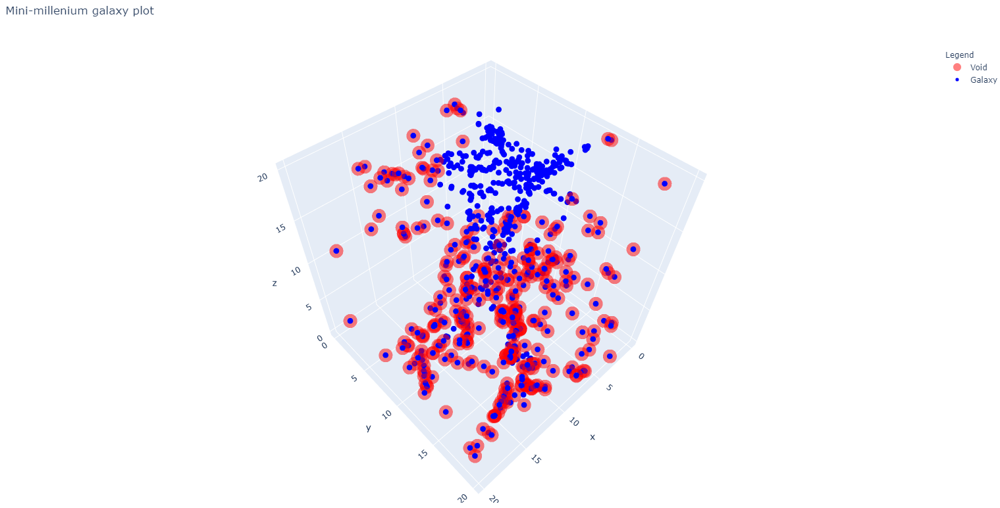

# Comic void finder

This program is a demo to find cosmic voids. The database used for this project is the [Millennium Simulation Project](https://wwwmpa.mpa-garching.mpg.de/galform/virgo/millennium/) and uses SQL queries to get information related to galaxies at redshift = 0. Further extensions of this project can be done such as speed improvements, better algorithms on finding voids, and general code quality.

## Example output

## Getting access to the full database

This project used the [VIRGO Database](http://gavo.mpa-garching.mpg.de/Millennium/). This is only a tiny subset of the full millennium-run simulation. Access to the full database will have to be requested manually.

## Getting started

1. Clone this repository
2. `pip install requirements.txt`
3. `python void_finder.py`

## Results

Results can be found [here](./results.md)

## Credit

This work uses the implementation from [halos2gal_wSQL](https://github.com/viogp/halos2gal_wSQL) to quer the Millennium databases.
